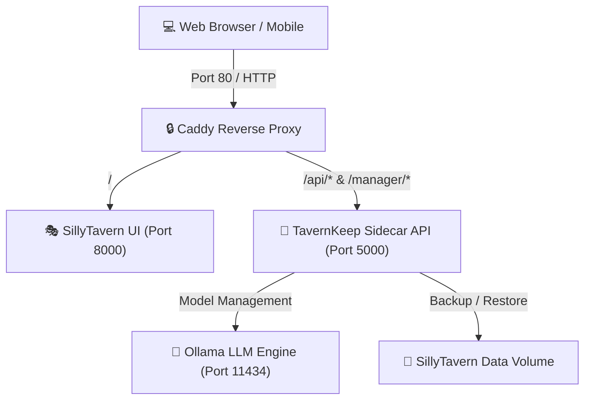

<div align="center">

  <h1>🏰 TavernKeep</h1>
  <p><strong>The Zero-Config 1-Click Self-Hosted Stack & Management Dashboard for SillyTavern & Local LLMs</strong></p>

  <p>
    <a href="https://github.com/rcisar77-stack/tavernkeep/blob/main/LICENSE"></a>
    <a href="https://github.com/rcisar77-stack/tavernkeep/actions"></a>
    <a href="https://www.python.org/"></a>
    <a href="https://www.docker.com/"></a>
    <a href="https://fastapi.tiangolo.com/"></a>
  </p>

  <p>
    <a href="#-quick-start">⚡ Quick Start</a> •
    <a href="#-features">✨ Features</a> •
    <a href="#-architecture">🏗️ Architecture</a> •
    <a href="#-api--dashboard">🎛️ Dashboard & API</a> •
    <a href="#-comparison">⚖️ Why TavernKeep?</a>
  </p>

  ---
</div>

## 🌟 Why TavernKeep?

Setting up [SillyTavern](https://github.com/SillyTavern/SillyTavern) locally with [Ollama](https://ollama.com/), SSL reverse proxies, extension management, and model pulling usually requires technical knowledge of Node.js, CLI commands, network routing, and manual backup scripts.

**TavernKeep** bundles everything into a **single containerized stack** with a **modern glassmorphic control panel**.

### ⚖️ Comparison

| Feature | Manual Setup | TavernKeep Stack |
|---|:---:|:---:|
| **Installation Time** | 30-60 mins | **< 1 minute** |
| **Model Downloader UI** | CLI only | **1-Click Web UI** |
| **Data Backup / Restore** | Manual copy | **Instant `.zip` Export/Import** |
| **Reverse Proxy & HTTPS** | Manual Nginx / Caddy | **Pre-configured Caddy** |
| **System Resource Gauges** | System Monitor | **Integrated Dashboard** |
| **Privacy & Cloud Cost** | $0 (if local) | **$0 (100% Local & Offline)** |

---

## ✨ Features

- **🚀 1-Click Launch:** Spuns up SillyTavern UI, Ollama LLM Engine, Caddy Reverse Proxy, and TavernKeep Sidecar with a single command.
- **🤖 LLM Model Manager:** Download any GGUF or Ollama model (e.g. `llama3:8b`, `mistral:7b`, `phi3:mini`) directly from your browser.
- **📦 One-Click Backup & Restore:** Safeguard your character cards, chat history, custom prompts, and settings with zip archives.
- **📊 Real-Time System Metrics:** Live hardware monitors for CPU, RAM, and Disk space utilization.
- **📱 Mobile-First Glassmorphic UI:** Modern, lightweight control panel accessible from desktop or mobile devices.

---

## 🏗️ Architecture



---

## ⚡ Quick Start

### Prerequisites
Make sure [Docker Desktop](https://www.docker.com/products/docker-desktop/) is installed and running.

### 1. Clone the Repository
```bash
git clone https://github.com/rcisar77-stack/tavernkeep.git
cd tavernkeep
```

### 2. Launch Stack

#### 🪟 Windows (PowerShell):
```powershell
.\scripts\install.ps1
```

#### 🐧 Linux / 🍎 macOS (Terminal):
```bash
chmod +x scripts/install.sh
./scripts/install.sh
```

---

## 🌐 Access Endpoints

Once launched, access your services at:

| Component | URL | Description |
|---|---|---|
| 🎭 **SillyTavern Web UI** | `http://localhost:8000` | Main character chat interface |
| 🏰 **TavernKeep Dashboard** | `http://localhost:5000/manager/` | Control panel for models & backups |
| 🔒 **Caddy Gateway** | `http://localhost:80` | Unified HTTPS reverse proxy |

---

## 🎛️ Dashboard & API Endpoints

TavernKeep exposes a high-performance **FastAPI** REST interface:

- `GET /api/system/health` - Health check status of all services
- `GET /api/system/stats` - Live CPU, Memory, and Disk usage metrics
- `GET /api/models` - List installed Ollama models
- `POST /api/models/pull` - Trigger background model download
- `DELETE /api/models/{model_name}` - Remove local model
- `GET /api/backups` - List available zip archives
- `POST /api/backups` - Create new timestamped backup
- `POST /api/backups/{filename}/restore` - Restore SillyTavern state

Interactive Swagger API docs are available at `http://localhost:5000/docs`.

---

## 🧪 Automated Testing

TavernKeep maintains a 100% passing test suite powered by `pytest`:

```bash
# Setup virtual environment
python -m venv venv
.\venv\Scripts\python -m pip install -r tavernkeep/requirements.txt

# Run unit & integration test suite
.\venv\Scripts\python -m pytest tavernkeep/tests -v
```

---

## 📜 License

This project is licensed under the **Source-Available & Anti-SaaS License (v1.0)**.
- **Free** for personal, internal, and business self-hosted deployment.
- **Prohibited:** Commercial hosting or reselling as a managed cloud service (SaaS) without prior written consent and commercial licensing from the author.

See [`LICENSE`](LICENSE) for complete terms.
